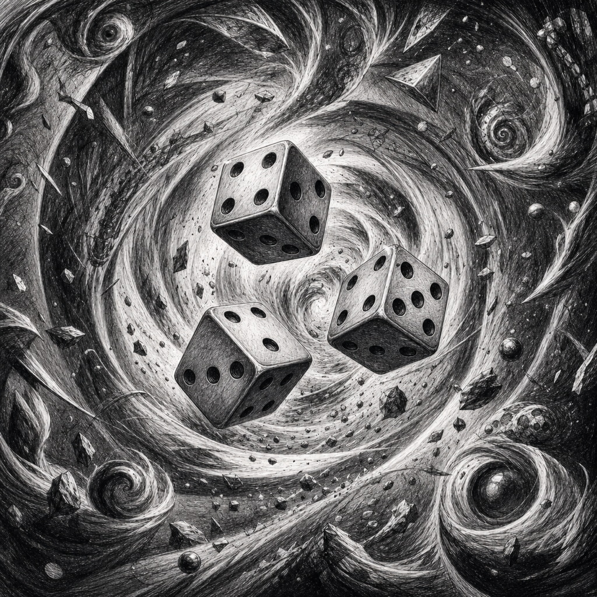

# fieldofchaos



`fieldofchaos` is a C implementation of the Field of Chaos Gold rules. The project builds a reusable static library plus a small command-line program that prints rule tables and deterministic examples from that library.

## Rules Source

The source of truth is `pdf/foc-just-the-rules-gold.pdf`.

Gold keeps the 2018 core rules and adds the agreed Shotgun and Grenade rules adapted from the newer rule set. The retained PDFs below are reference-only:

- `pdf/foc-just-the-rules-2018.pdf`
- `pdf/foc-just-the-rules-2024.pdf`
- `pdf/field-of-chaos-rpg-070524.pdf`
- `pdf/foc_rpg_051018.pdf`

`TRACEABILITY.md` maps the Gold PDF rule families to C APIs, CLI output, and tests.

## Project Layout

- `src/include/fieldofchaosgold.h`: public C API
- `src/lib/fieldofchaosgold.c`: rules implementation
- `src/lib/fieldofchaosgold_internal.h`: internal dice helpers
- `src/cli/fieldofchaosgold.c`: command-line examples and rule tables
- `src/tests/`: focused C test programs
- `TRACEABILITY.md`: Gold PDF to C/API/test parity matrix
- `png/cover.PNG`: cover image used by the Gold PDF and this README

## Build

Run commands from `src/`:

```sh
cd src
make
make test
make clean
```

`make lib` builds the static library at `src/build/libfieldofchaosgold.a`. `make` builds both that library and the CLI program at `src/build/fieldofchaosgold`.

The project currently uses a Makefile-based C build. There is no Xcode project in the source tree.

## Gold Rules Covered

The README mirrors the executable rule content in `pdf/foc-just-the-rules-gold.pdf`; the PDF remains authoritative when wording matters.

### Character Generation And Stats

- Characters have five stats: Regular Intelligence (RE), Irregular Intelligence (IR), Appearance (AP), Physical Health (PH), and Mental Health (ME).
- Character generation rolls 3d6, inverts two chosen dice, applies one +2 value and four +1 values, then assigns the five values to the five stats.
- Initial stats are capped at 30 total. Long-term stats are capped at 40 total.
- Skill selection is validated against the stat tied to each skill: one selected skill per point in that stat area.
- Skill prerequisites count as selected skills and must be present before dependent skills are valid.

### Skill Hierarchy

- Firearm Use, Basic is PH-based and provides the first ranged skill die. Shotgun use is covered by Firearm Use, Basic.
- Firearm Use, Advanced is ME-based, requires Firearm Use, Basic, and provides the second ranged skill die.
- Close Combat is PH-based.
- Improvised Weapon Use, Basic and Clandestine Weapon Use, Basic are IR-based.
- Carpentry is a prerequisite for Manufacture Clandestine Weapon.
- Chemistry, Basic is a prerequisite for Explosive Engineering.
- Biology, Basic and Chemistry, Basic are prerequisites for Chemistry, Advanced.
- Chemistry, Advanced is a prerequisite for Pharmaceutical Chemistry.
- First Aid is a prerequisite for Paramedic.
- Grenades have no skill modifier in Gold. Explosive Engineering does not modify grenade use.
- Pharmaceutical Chemistry has no Gold healing effect.

### Ranged Weapons

| Weapon | Close | Standard | Long | Movement | Gold notes |
| --- | ---: | ---: | ---: | --- | --- |
| Sniper Rifle | 24 in | 36 in | 48 in | Very Slow | One shot, cannot fire under 12 in, can called-head-shot |
| Rifle | 18 in | 27 in | 36 in | Slow | One shot, or two with Firearm Advanced |
| Carbine | 12 in | 18 in | 24 in | Standard | One shot, or two with Firearm Advanced |
| Automatic | 8 in | 12 in | 16 in | Standard | Two shots, jams on 1 on 2d6, no head shot |
| SubMG | 6 in | 9 in | 12 in | Fast | Three shots, jams on 1 on 1d6, no head shot |
| Shotgun | Cone | Cone | Cone | Referee-set | 15 in cone attack, covered by Firearm Basic |

- Close range uses 1d6 and hits on 4-6. A close-range head shot requires 6.
- Standard range uses 2d6 and hits on 10-12. A standard-range head shot requires 12.
- Long range uses 3d6 and hits on 16-18. A long-range head shot requires 18.
- Light cover subtracts 1 die. Heavy cover subtracts 2 dice.
- Standard target movement subtracts 1 die. Fast target movement subtracts 2 dice.
- Target Evade subtracts 1 die. Grenade debris counts as light cover.
- Standard clips hold 10 rounds. Reloading takes one turn. Clearing a jam takes one turn.
- Called head shots require two setup moves before firing and miss entirely if the called shot misses.

### Shotgun

- Shotgun uses a 15 inch cone and Firearm Use, Basic.
- The nearest occupied cone band is the only band damaged.
- Near band: 0-5 inches, width 1 inch, 2d6 wounds.
- Middle band: over 5-10 inches, width 2 inches, d6 wounds.
- Far band: over 10-15 inches, width 3 inches, d3 wounds.
- Allies inside the affected band are included.
- Each wound uses the normal 3d6 hit-location rule.

### Grenade

- Grenade throw range is 12 inches.
- Reliability is 2d6. A total of 4 or less is a dud. Dud grenades cause no blast damage.
- Open terrain blast bands: inner 1 inch for d6 wounds, middle 3 inches for d3 wounds, outer 4 inches for d2 wounds.
- Building blast bands: inner 3 inches, middle 6 inches, outer 9 inches, using the same wound dice by band.
- Grenade debris gives light cover.
- Allies inside the blast area are included.
- Each wound uses the normal 3d6 hit-location rule.
- Throwing one grenade halves movement, rounded down. Throwing two grenades requires being stationary and consumes the turn.

### Movement

| Pace | Base movement | Skill modifier |
| --- | ---: | --- |
| Very Slow | 2 in | +1 with Evade |
| Slow | 3 in | +1 with Marching |
| Standard | 5 in | +1 with Marching |
| Fast | 8 in | +2 with Running |

- One disabled leg halves movement.
- Two disabled legs prevent movement.
- Weapon-specific movement limits are represented in the library.

### Wounds And Hit Locations

| Location | Wounds |
| --- | ---: |
| Head | 1 |
| Chest | 4 |
| Abdomen | 2 |
| Left Arm | 1 |
| Right Arm | 1 |
| Left Leg | 2 |
| Right Leg | 2 |

- One arm at 0 wounds prevents firearm use.
- Head, chest, or abdomen at 0 wounds causes unconsciousness.
- Less than 6 total wounds is grave condition. 0 total wounds is dead.
- 3d6 hit locations: 3-8 leg with odd left and even right, 9-13 chest, 14-15 abdomen, 16-17 arm with odd left and even right, 18 head.

### Melee And Healing

- Blow attacks use 1d6 and hit on 3-6.
- Weapon melee attacks use 1d6 and hit on 4-6.
- Relevant melee skills add skill dice to melee attacks.
- No-skill healing rolls 1d6 and recovers on 6.
- Bandage/equipment healing rolls 1d6 and recovers on 5-6.
- First Aid rolls 2d6 and uses the highest die.
- Paramedic rolls 3d6 and uses the highest die.
- Successful healing restores one wound to a target wound pool without exceeding the maximum.

### Special Foes

- Animal attacks receive +1 die.
- Animal head shots release Psychnosis Gas and require confirmation on 5-6 on d6.
- Animal gas attacks require double rolls and halve movement. Gas starts at d6+6 inches, shrinks 2 inches per turn, and drifts 2 inches in a d6 direction.
- Hunters receive +1 movement.
- Soldier armor saves on 5-6 on d6.
- Shotgun damage counts for Soldier armor. Grenade damage only counts for Soldier armor when the referee chooses to count it.

### Explicit 2024 Exclusions

Gold does not include the 2024 use-based skill advancement table, the 2024 Pharmaceutical Chemistry healing effect, the 2024 ranged thresholds, the 2024 SubMG rewrite, the 2024 body-only wound pool, the 2024 grave-condition PH roll, or the 2024 winded/chest-body rule.

## CLI Examples

```sh
cd src
./build/fieldofchaosgold stats
./build/fieldofchaosgold skills
./build/fieldofchaosgold weapons
./build/fieldofchaosgold shotgun
./build/fieldofchaosgold grenade
./build/fieldofchaosgold movement
./build/fieldofchaosgold wounds
./build/fieldofchaosgold locations
./build/fieldofchaosgold melee
./build/fieldofchaosgold healing
./build/fieldofchaosgold foes
./build/fieldofchaosgold tables
./build/fieldofchaosgold attack
./build/fieldofchaosgold blast
./build/fieldofchaosgold heal
./build/fieldofchaosgold armor
./build/fieldofchaosgold all
```

The CLI prints Gold rule tables for stats, skill hierarchy and accounting, weapons, Shotgun, Grenade, movement, wounds, hit locations, melee, healing, and foes. It also prints deterministic examples for ranged attacks, Shotgun area resolution, Grenade area resolution, melee, healing application, and Soldier armor.

## Library Surface

Include `src/include/fieldofchaosgold.h` and link against `src/build/libfieldofchaosgold.a`.

The public API exposes helpers and resolvers for:

- dice seeding and damage rolls
- stat generation and validation
- skill metadata, prerequisite validation, and skill accounting
- weapon ranges, movement limits, head-shot permissions, jam checks, reloads, and ammunition mutation
- ranged attack resolution
- Shotgun cone geometry and area damage
- Grenade reliability, blast geometry, area damage, and grenade action economy
- movement, wound pools, hit locations, wound mutation, death/unconscious/grave checks, and firearm eligibility
- melee attack resolution
- healing rolls and healing application
- animal, hunter, and soldier foe rules

## Verification

Run `make test` from `src/` to build the static library, build all focused test programs, and execute them. The test suite covers the Gold rules represented in the C library and regression-tests the intentionally excluded 2024 rules.
